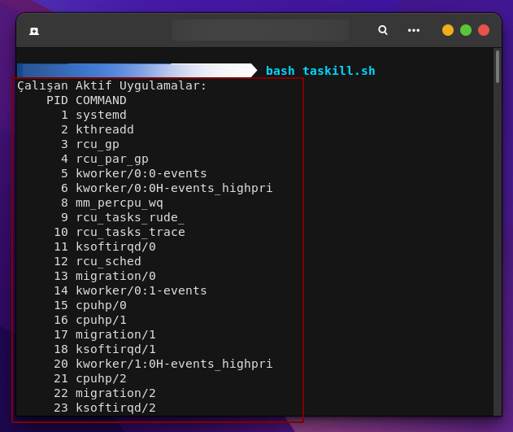
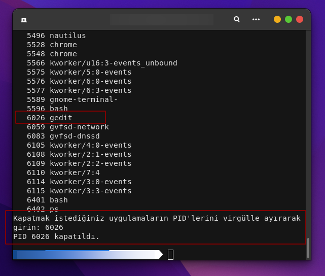

<a href="https://github.com/pedromxavier/flag-badges">
    
</a>

# taskiller
This tool is especially used in servers and general purpose terminals. Allows closing one or more tasks via

Install Git Clone 

Github Package Must Be Installed On Your Device.
```bash
sudo apt install git  -y
```

----------------------------------
# Installation
Install taskiller
```bash
sudo git clone https://github.com/cektor/taskiller.git
```
```bash
cd taskiller/
```
```bash
sudo chmod +x taskiller.sh
```
```bash
./taskiller.sh
```


# Screenshot

    
